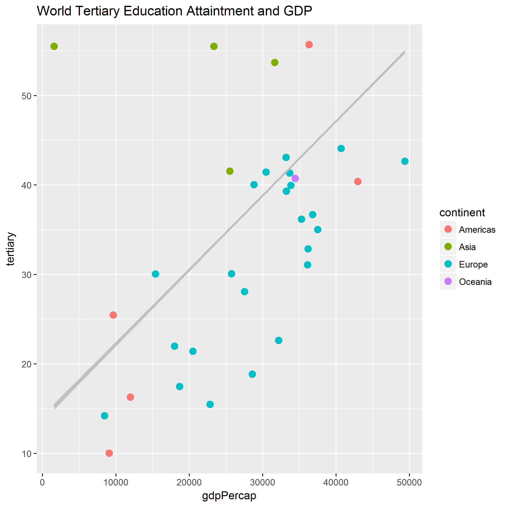
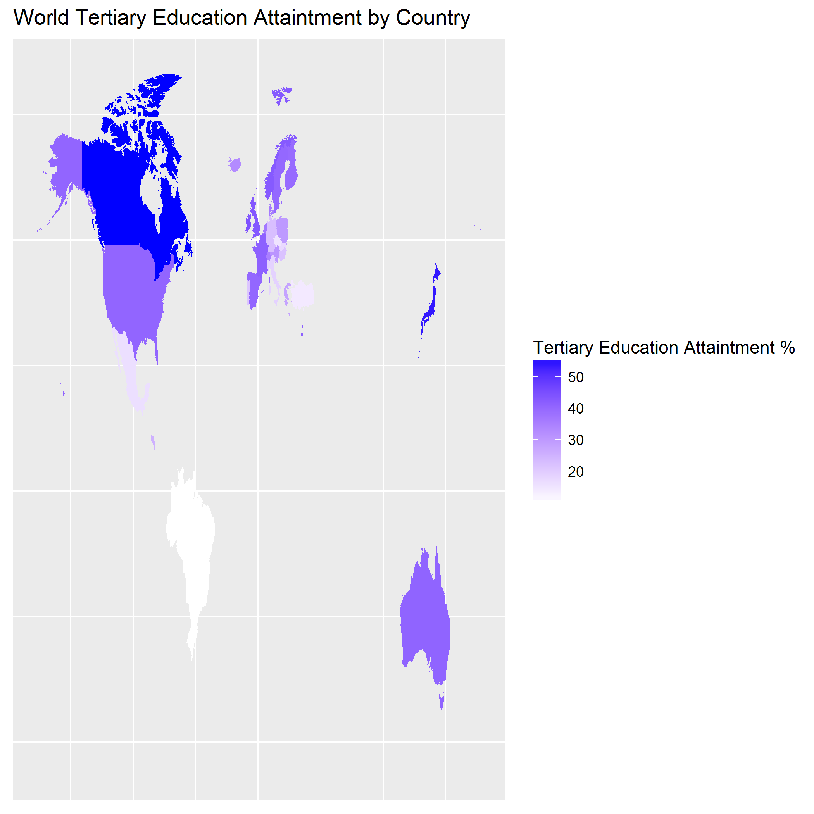

```{r setup, include=FALSE}
knitr::opts_chunk$set(echo = TRUE)
```

```{r, include=FALSE}
corr<-read.csv("data/corr.csv", strip.white=TRUE)
```
# Hypothesis/Objective:
The hypothesis I want to test is whether there is correlation between tertiary education attainment and national GDP. Population with tertiary education is defined as those having completed the highest level of education, by age group. This includes both theoretical programs leading to advanced research or high skill professions. 

In this analysis, the focus is on the 25-34 age group and year 2007

# Exploratory Data Analysis
From the scatter plot below, we can see a clear trend between tertiary education attainment and national GDP:


# Pearson Correlation and P-value
Using the `cor.test()` function in R, I found the Pearson's correlation between GDP per capita and tertiary education attainment to be `r corr[1]` and the p-value to be `r corr[3]`.

# Conclusion
There is statistically significant, moderately strong positive correlation between GDP per capita and tertiary education attainment

Tertiary education attainment in percentage by country:
